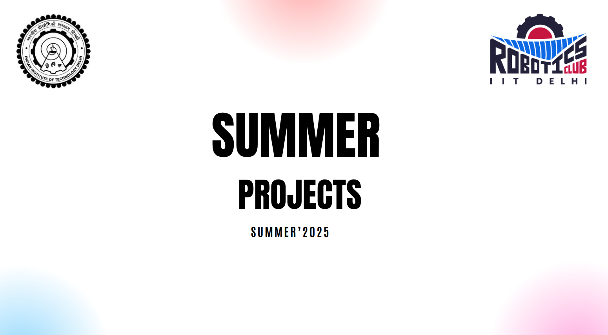

# ⚽ RoboSoccer Bot Development 2025-26

  
  
  

  

    
  

---

## 🤖 Project Overview

This repository contains the complete development workflow for our **RoboSoccer bots built for Tryst 2026**. It includes CAD designs, hardware integration, control systems, and competition insights.

We successfully developed **two bots**:
- ⚔️ Attacker Bot  
- 🛡️ Defender Bot  

The project focused on building **robust, competition-ready robots** under strict time and resource constraints.

> Goal: Deliver reliable, high-performance bots capable of competitive gameplay.

---

## 🎯 Design Goals

- ✅ Robust aluminium chassis (3mm waterjet cut)
- ✅ High traction and grip for pushing capability
- ✅ Compact and stable structure
- ✅ Reliable motor control system
- ✅ Fast deployment under time constraints
- ✅ Attacker–Defender coordination

---

## ⚙️ System Architecture

### 🔩 Mechanical
- 3mm Aluminium chassis (waterjet fabricated) :contentReference[oaicite:0]{index=0}  
- Compact rectangular frame design  
- High-grip 10 cm wheels  

### 🔌 Electronics
- Arduino Uno (control unit)  
- Cytron Motor Driver Shield  
- Johnson DC Motors  
- 3S Li-Po battery  

### 🎮 Control
- RC-based manual control system  
- Differential drive configuration  

---

## 🧠 Development Workflow

### Phase 1: Ideation & Design
- Explored drivetrain and chassis concepts  
- Evaluated weight constraints → removed complex mechanisms  
- CAD modelling and iterative refinement :contentReference[oaicite:1]{index=1}  

### Phase 2: Fabrication
- Aluminium parts waterjet cut  
- Rapid manufacturing pipeline  

### Phase 3: Assembly & Integration
- Mechanical assembly  
- Electronics integration  
- Coding and testing completed in **~2 days** :contentReference[oaicite:2]{index=2}  

---

## 📊 Bill of Materials (BOM)

| Component | Qty | Unit Cost (₹) | Total (₹) |
|----------|----|--------------|----------|
| Arduino Uno | 2 | 230 | 460 |
| Cytron Motor Shield | 3 | 1400 | 4200 |
| Johnson DC Motors | 8 | 450 | 3600 |
| RC Remote Controllers | 2 | 4600 | 9200 |
| 10 cm Wheels | 8 | 230 | 1840 |
| 3S Li-Po Battery | 2 | 2000 | 4000 |
| **Total** |  |  | **₹23,300** |

> Note: One motor driver was damaged during competition. :contentReference[oaicite:3]{index=3}  

---

## ⚠️ Challenges Faced

- Limited time (≈ 1 week before minors)
- Shortage of aluminium sheets → only 2 bots fabricated  
- Incorrect motor shaft type → wheel detachment issue  
- Microcontroller failure during match due to impact  

---

## 🏆 Competition Performance

- Both bots were functional initially  
- One bot flipped → caused controller short  
- Only one bot continued after emergency fix  
- Final Rank: **9 / 25 teams** :contentReference[oaicite:4]{index=4}  

---

## 🔧 Emergency Fixes

During match break:
- Replaced damaged microcontroller  
- Searched for compatible motors  
- Only one suitable motor available → single bot deployment  

---

## 💪 Bot Strengths

- Excellent traction and grip  
- Strong pushing capability  
- Stable motion under normal conditions  
- Effective attacker–defender coordination  

---

## 📉 Key Learnings

### 🔹 Technical
- Start earlier → logistics is critical  
- Prioritize robustness over complexity  
- Improve motor–wheel coupling  
- Enhance anti-flip stability  

### 🔹 Team & Execution
- Need structured team divisions:
  - Mechanical  
  - Electronics  
  - Logistics  
- Improve communication and accountability  
- Encourage independent problem solving  

---

## 🚀 Future Scope

- Build a **dedicated RoboSoccer team (freshers)** for continuity  
- Improve drivetrain reliability and stability  
- Maintain spare components inventory  
- Develop multiple bots for redundancy  
- Participate in **external competitions beyond college**  

---

## 🤝 Contributor Notes

- Follow standard Git workflow  
- Maintain modular documentation  
- Keep design iterations version-controlled  

Suggestions and improvements are welcome via **Issues / PRs**.

---

## 📌 Repository Structure (Suggested)
